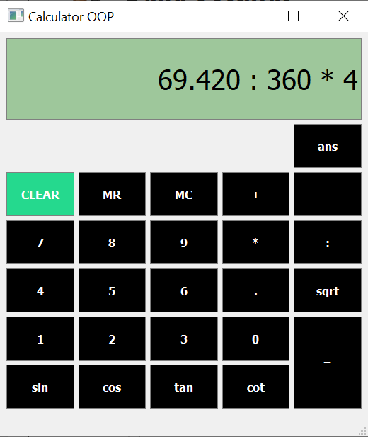

# Tugas Besar 1 Pemrograman Berorientasi Objek IF2210
## Kalkulator Sederhana

Dibuat oleh: 

<ul>
    <li>Fatkhan Masruri - 13518053</li>
    <li>Felicia Gojali - 13518101</li>
    <li>Muhammad Kamal Shafi - 13518113</li>
    <li>Valentinus Devin Setiadi - 13518116</li>
</ul>

# Strutur File / Kode

        ├── Calculator           
        │   ├── Exception
        │   │   ├── Exception.h
        │   ├── Expression
        │   │   ├── Expression.h
        │   ├── Parser
        │   │   ├── CalcParser.h
        │   ├── Testing
        │   │   ├── testing.cpp
        │   │   ├── testing.exe
        │   │   ├── hasil.txt
        │   ├── calculator.cpp
        │   ├── calculator.h
        │   ├── calculator.ui
        │   ├── catch.cpp
        │   ├── CMakeList.txt
        │   ├── CMakeList.txt.user
        │   ├── main.cpp
# Menjalankan program
## Prerequisites
<ul>
    <li>Qt Creator 4.11.1 (community)</li>
</ul>

## Required Kits on Qt
<ul>
    <li>Qt 5.14.1</li>
    <li>MinGW 7.3.0 C/C++</li>
    <li>CMake 3.16.0</li>
</ul>
    
Kits dapat didownload saat installasi Qt Creator

Qt dapat didownload melalui website:
https://www.qt.io/download

## *Compiling and Running the Program*

### Cara 1:
1. Buka Qt Creator
2. Open new project
3. Pilih CMakeList.txt dari project
4. Run program

### Cara 2 (*in-case kalo* cara pertama tidak berhasil):
1. Buka Qt Creator
2. Create new project
3. Copy file .cpp .h .ui dari project yang ingin di-run ke projek yang baru dibuat
4. Run program

# *Screenshot Aplikasi*

